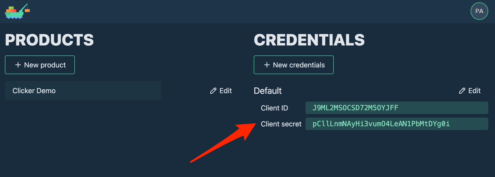

# Planship Nuxt 3 Clicker Demo

Welcome to the [Planship](https://docs.planship.io) demo app built with [Nuxt 3](https://nuxt.com) that uses [Pinia](https://pinia.vuejs.org/). This app demonstrates the use of Planship for implementing subscription plans with feature and usage-based entitlements.


## What is the Clicker Demo app?

Clicker Demo is a hypothetical app that provides its customers with a few simple features, most notably buttons that can be clicked to generate _clicks_. The app offers three subscription plans, *Small*, *Medium* and *Large*, that provide access to different features and limits on the number of allowed _clicks_.


All of the pricing logic including subscription management, feature and usage entitlements, and usage metering, has been implemented with Planship.

## Getting started

To get started, sign up for Planship at https://app.planship.io/auth/sign-up and navigate to the default organization that Planship created for you. You will see the `Clicker Demo` product and the default Planship API security credentials.



Next, clone this repository and create a `.env` file in the project root directory.

```sh
git clone git@github.com:planship/planship-nuxt-example.git
cd planship-nuxt-example
touch .env
```

Then, add your Planship API credentials to the `.env` file.

```env
PLANSHIP_API_CLIENT_ID=QNR32DJSDZ3ZI3ZJLMT6
PLANSHIP_API_CLIENT_SECRET=lCiTw5CBhO3RZvbC0fBGB89zMMF2jNf9
```

Finally, install all dependencies and run the app.

```sh
pnpm install
pnpm dev
```

## Next steps

To get started with Planship for your own product, check out the [Planship integration guide](https://docs.planship.io/integration). You may also want read more about core concepts like [feature levers](https://docs.planship.io/planship/feature-levers/), [metered usage](https://docs.planship.io/planship/metered-usage/), and [plans](https://docs.planship.io/planship/plans/).
